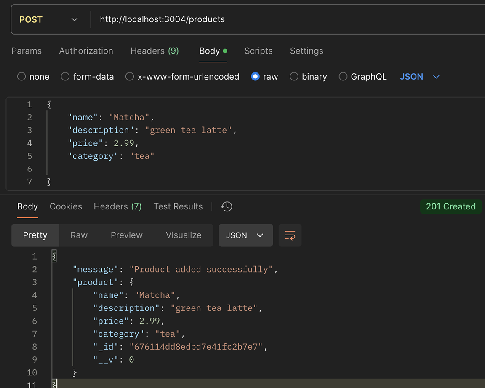
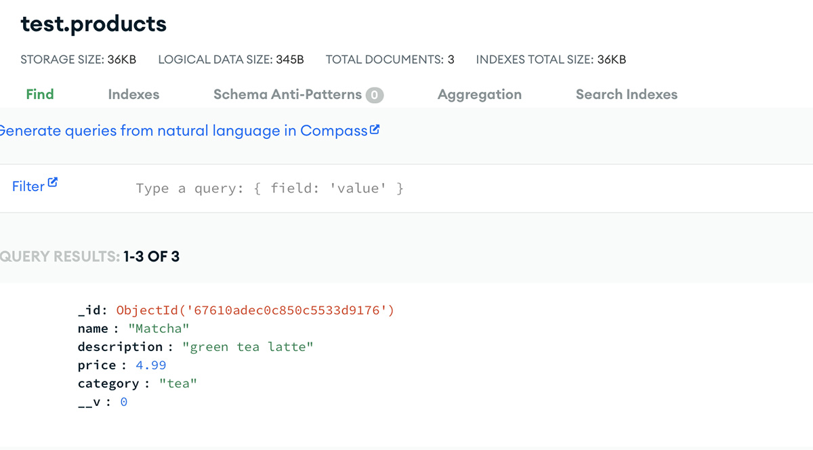
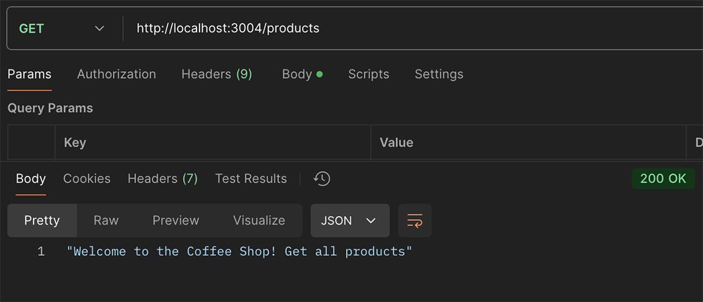
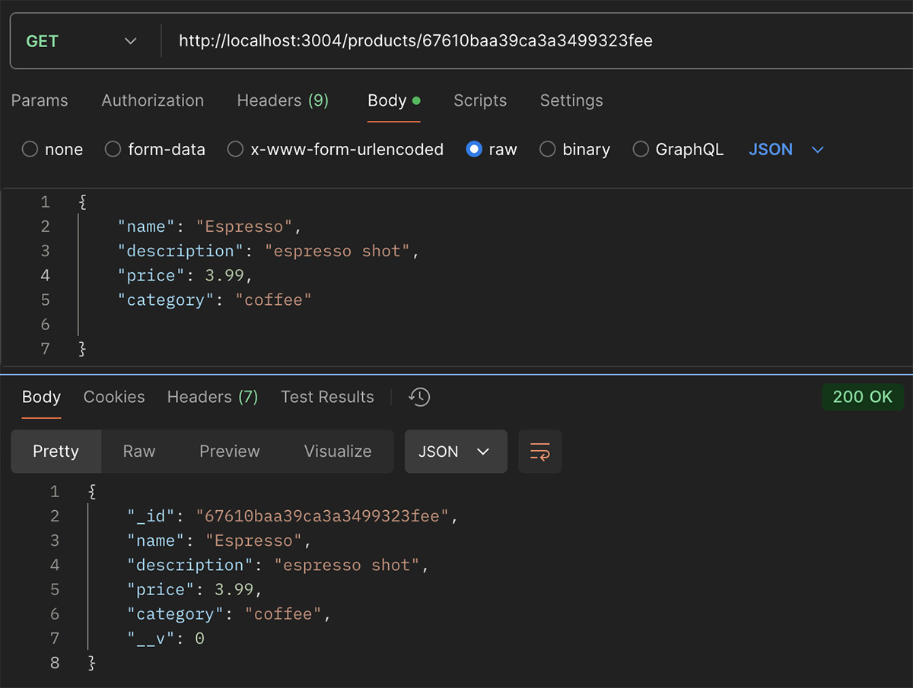
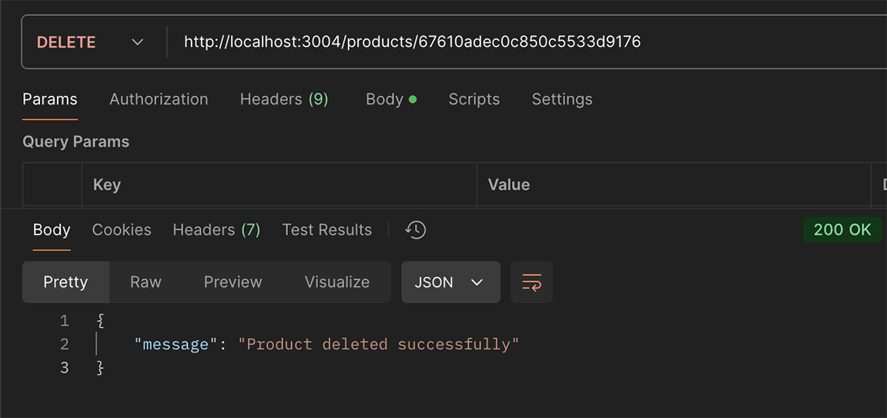
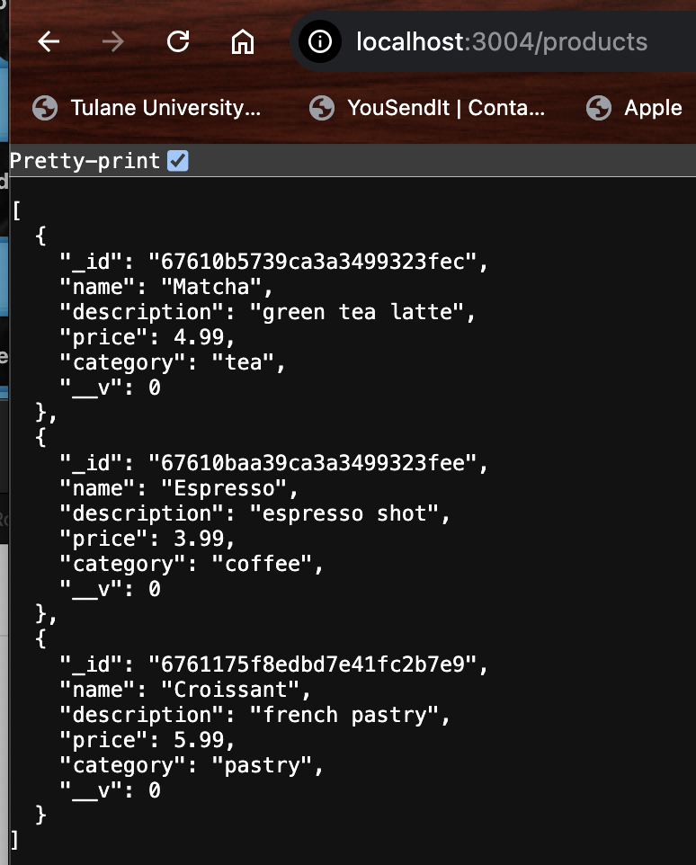
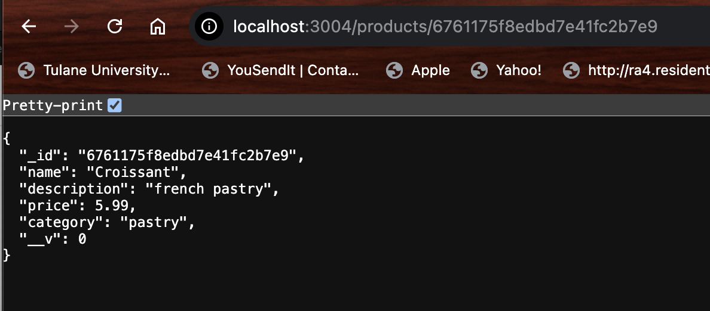

## **Coffee-Shop-Backend**

## **Objective**
- Set up a new Express project for a coffee shop e-commerce site backend.
- Connect to MongoDB using Mongoose.
- Define the Product model.
- Implement and test basic CRUD operations for products.

## **Instructions**
- [x] Part 1: Set Up the Project & Set up Server (port 3004)
- [x] Part 2: Define the Product Model
- Create the Product Schema and Model:
- [x] Part 3: Implement Basic CRUD Operations
- Setup the Routes directory and create the first route for the products.

! [Alt text](imgs/instructions.png)

## **Create the Routes**
- POST - Create a new Product

- GET /products: Get all products 

- GET /:id: Get a single product by ID

- PUT /:id: Update a product by ID

- DELETE /:id: Delete a product by ID

## **Part 4- Test the apis**

- GET /products all products

- GET single product

